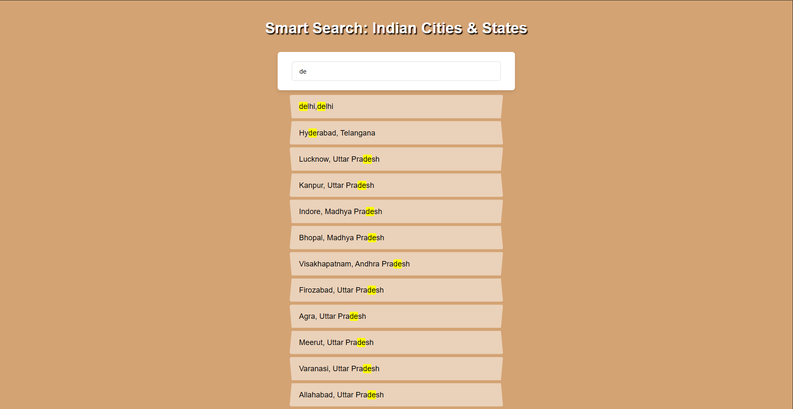

# 🇮🇳 Indian City & State Live Search Application

A fast, interactive live search tool to find Indian cities and states in real-time.  
Built with JavaScript, Fetch API, Array Methods, Regex, and dynamic DOM rendering.

------------------------------------------------------------

## 📸 Preview

------------------------------------------------------------

## 🚀 Features

- Live search with instant updates  
- Searches both city and state  
- Highlights only the matched part  
- Loads JSON data using Fetch API  
- Uses .filter(), .map(), .replace(), spread operator  
- Simple and lightweight UI  

------------------------------------------------------------

## 📂 Project Structure

project-folder/
├── index.html
├── style.css
├── script.js
├── assets/
│   └── cities.json
└── preview.png

------------------------------------------------------------

## 🧠 How It Works

1) Fetching Data

fetch("./assets/cities.json")
  .then(res => res.json())
  .then(data => cities.push(...data));

------------------------------------------------------------

2) Finding Matches

function findMatches(word, cities) {
  return cities.filter(place => {
    const regex = new RegExp(word, "gi");
    return place.name.match(regex) || place.state.match(regex);
  });
}

------------------------------------------------------------

3) Highlighting Matches

const cityName  = place.name.replace(regex, "$&");
const stateName = place.state.replace(regex, "$&");

------------------------------------------------------------

4) Displaying Results

searchInput.addEventListener("input", displayMatches);

------------------------------------------------------------

## 🧩 Sample JSON

[
  { "name": "Mumbai", "state": "Maharashtra" },
  { "name": "Delhi", "state": "Delhi" }
]

------------------------------------------------------------

## 🏗 How to Run

1. Download the project  
2. Keep cities.json inside /assets/  
3. Open index.html  
4. Start typing in search bar  
5. Results appear instantly  

------------------------------------------------------------

## 💡 Future Enhancements

- Add population or pin codes  
- Add sorting/grouping  
- Convert to autocomplete dropdown  
- Add animations  

------------------------------------------------------------

## 📜 License
Free for personal and educational use.
